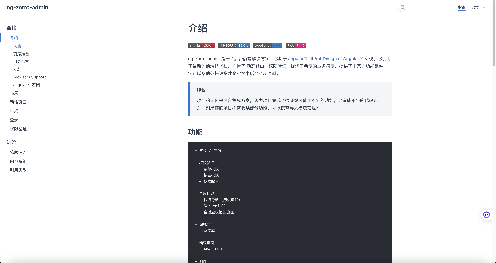

## yoyo-admin-lite

基于Springboot + Angular 实现的通用管理系统后端框架，内部整合了常见的中间件框架和常用的工具类，有基于Vuepress实现的配套在线技术文档。

## 1. 项目概述

### 1.1 技术选型

后端：Springboot（后端主体） + Spring-Security（安全权限框架）+ Spring Data JPA（ORM框架）+ Scheduled（定时任务） + Swagger（接口文档）

前端：Angular（前端主体）+ NgZorro（组件库）+ Echarts（可视化图表）

### 1.2 项目结构

```
.
├── common                // 后端公共模块（必须加载）
├── redis_common          // redis公共模块（按需加载）
├── es_common             // es公共模块（按需加载）
├── kafka_common          // kafka公共模块（按需加载）
├── minio_common          // minio公共模块（按需加载）
├── periodical_task       // 定时任务模块（按需开启）
├── web_manage            // web后端管理模块（常规应用）
├── toolbox               // 后端工具模块（用于生成代码及文档，可丢弃）
├── pom.xml               // 后端配置文件
├── project_doc           // 项目文档（包含部署配置及数据表设计文档）
├── ng-zorro-admin        // 前端模块
└── ng-zorro-admin-doc    // 前端技术文档
```

### 1.3 项目截图

前端Web界面（默认`http://localhost:8082`）：


前端在线技术文档（默认`http://localhost:8083`）：



Swagger接口文档（默认`http://localhost:8081/doc.html`）：


Druid监控面板（默认`http://localhost:8081/druid/index.html`）：


## 2. 后端注意事项

### 2.1 项目启动及打包

本项目的后端需要JDK8（建议JDK1.8.0-161以上版本）、Maven环境

项目启动：修改.properties配置文件、拉取项目依赖，启动web_manage模块下的WebManageApplication.java。

项目打包：mvn clean package

### 2.2 后端注意事项

**[1] 登录账号及密码**

业务系统管理员：与AES密钥及设置的管理员密码有关，密钥在SessionHolder.java进行配置，加密解密详见AesUtils.java，默认 `admin / 328mkl#Gt*dhk&u#`

Swagger接口文档：见.properties配置文件，默认 `admin/123456`

```properties
swagger.basic.username=admin
swagger.basic.password=123456
```

Druid监控面板：见.properties配置文件，默认 `admin/123456`

```properties
spring.datasource.druid.stat-view-servlet.login-username=admin
spring.datasource.druid.stat-view-servlet.login-password=123456
```

**[2] 定时任务的开启与关闭**

修改.properties配置文件即可控制开启与关闭

```properties
# periodical-task settings
settings.task.enabled=false
```

**[3] 模块的按需启用**

Step1：在应用模块的pom.xml里注释掉（主要检查common、web_manage即可）

```xml
<dependencies>
    <!-- 公共模块-->
    <dependency>
        <groupId>${project.groupId}</groupId>
        <artifactId>common</artifactId>
        <version>0.0.1</version>
    </dependency>
    <!-- Kafka公共模块-->
    <dependency>
        <groupId>${project.groupId}</groupId>
        <artifactId>kafka_common</artifactId>
        <version>0.0.1</version>
    </dependency>
    <!-- 定时任务模块-->
    <dependency>
        <groupId>${project.groupId}</groupId>
        <artifactId>periodical_task</artifactId>
        <version>0.0.1</version>
    </dependency>
</dependencies>
```

Step2：在总pom.xml注释掉不需要的模块，重新加载依赖即可。

```xml
    <modules>
        <module>toolbox</module>
        <module>common</module>
        <module>redis_common</module>
        <module>kafka_common</module>
        <module>es_common</module>
        <module>minio_common</module>
        <module>web_manage</module>
        <module>periodical_task</module>
    </modules>
```

**[4] 可能存在的坑：AES加密解密异常**

报错描述：AES加密解密处报 java.security.InvalidKeyException: Illegal key size or default parameters 异常

报错原因：在我们安装JRE的目录下有这样一个文件夹：%JAVE_HOME%\jre\lib\security，其中包含有两个.jar文件：“local_policy.jar ”和“US_export_policy.jar”。JRE中自带的“local_policy.jar ”和“US_export_policy.jar”是支持128位密钥的加密算法，而当我们要使用256位密钥算法的时候，已经超出它的范围，无法支持，所以才会报：“java.security.InvalidKeyException: Illegal key size or default parameters”的异常。

解决办法：

- 方法一：下载单独策略文件，替换原来的文件。

  其对应的JCE下载地址为：[http://www.oracle.com/technetwork/java/javase/downloads/jce8-download-2133166.html](http://www.oracle.com/technetwork/java/javase/downloads/jce8-download-2133166.html)

  下载完后，解压，将其中的“local_policy.jar ”和“US_export_policy.jar”两个文件替换掉自己`%JAVE_HOME%\jre\lib\security`文件夹下对应的原文件。

- 方法二：将jdk升级到JDK1.8.0-161以上版本，就不需要单独策略文件了。

### 2.2 工具类库使用

- common模块中使用了Lombok，需要安装Lombok插件。
- 项目大部分自定义代码采用了阿里编码规范标准，可以安装阿里编码规范工具进行代码扫描，后续的开发也应尽量符合该标准，提高代码的可维护性。
- 工具类库推荐使用Hutool， 常用的字符串操作、时间日期操作、Excel导入导出等都可以找到方便的工具类。

### 2.3 Restful规范

- 接口URL请求使用GET、POST，修改和删除接口避免使用PUT、DELETE，防止有些服务器无法识别这两类请求。
- 接口URL统一增加前缀"/api"以便进行登录权限校验。

## 3. NgZorroAdmin前端模块

### 3.1 模块描述

基于 [Angular CLI](https://github.com/angular/angular-cli) 13.1.0 实现的通用前端框架，NgZorro组件库官方文档：[https://ng.ant.design/docs/introduce/zh](https://ng.ant.design/docs/introduce/zh)

示例里的delon，来源于另一个基于NgZorro组件库的NG-ALAIN框架，官方文档：[https://ng-alain.com/components/xlsx/zh](https://ng-alain.com/components/xlsx/zh)

提供两套布局，在 main-routing.module.ts 文件进行配置，可选项为 MainLayoutDefaultComponent 和 LayoutTopSideComponent

### 3.2 项目启动及打包

依赖安装：

```
$ npm install -g @angular/cli   // 安装Angular CLI
$ npm install   // 安装依赖
```

修改配置：/src/@service/crypto.service.ts 文件设置了AES加密密钥，应与后端保持一致。

项目启动：

```
$ ng serve --proxy-config proxy.conf.json --open --port=7300
```

项目打包：

```
$ npm run build
```

注意事项：不要使用 `ng build --base-href ./ ` 命令进行打包，部署到服务器后会出现如下报错，导致刷新后页面空白。

```
Failed to load module script: Expected a JavaScript module script but the server responded with a MIME type of "text/html". Strict MIME type checking is enforced for module scripts per HTML spec.
```

## 4. NgZorroAdminDoc文档模块

基于Vuepress实现的在线技术文档，只有前端的说明。

### 4.1 项目启动及打包

安装依赖：

```
$ npm install
```

启动与构建：

```
$ npm run docs:dev       // 启动
$ npm run docs:build     // 构建
```

### 4.2 注意事项

1）如果启动时遇到了 `this[kHandle] = new _Hash(algorithm, xofLen);` 问题，请执行以下命令，参考 [Github issue](https://github.com/ant-design/ant-design-pro/issues/9272)

```
$ export NODE_OPTIONS=--openssl-legacy-provider
```

2）本地运行和打包时配置文件需要进行修改

```
  base: "/doc/",  // 本地运行
  base: "/",      // 打包部署
```

3）生成的构建文件夹

```
docs/.vuepress/dist
```

## 5. 项目整体部署

以Docker的方式进行打包，后端、前端、文档、Nginx都打在一个Docker镜像里，配置文件见 `project_doc/docker_deploy `目录

### 5.1 前后端项目打包

前端项目打包

```
$ npm install -g @angular/cli   
$ npm install   
$ npm run build
```

后端项目打包

```

$ mvn clean
$ mvn install
$ mvn package
```

### 5.2 准备部署包

```
.
├── config
    ├── application-prod.properties
    └── application.properties
├── dist.zip
├── dist_doc.zip
├── Dockerfile
├── nginx.conf
├── proxy.conf
├── yoyo_web.conf
├── yoyo_web_doc.conf
├── web_manage-0.0.1.jar
├── unzip.sh
├── build.sh
├── rebuild.sh
└── start_web.sh
```

一般而言，需要按需修改的配置文件有 Dockerfile、yoyo_web.conf、yoyo_web_doc.conf、build.sh、rebuild.sh

### 5.3 服务器部署

[1] 初次部署

```
切换到工作目录
$ chmod u+x unzip.sh build.sh rebuild.sh
$ ./build.sh
启动成功后，项目就部署好了，Chrome访问 `IP:8082`地址即可访问前端页面，8081端口是留给后端的，8083端口是留给前端文档的。
```

[2] 后续更新

```
切换到工作目录
把 dist.zip、dist_doc.zip和 web_manage-0.0.1.jar 更换掉，然后执行 rebuild.sh 脚本即可
```

## 6. Git使用规范

### 6.1 版本规范

语义版本号分为 X.Y.Z 三位，分别代表主版本号、次版本号和补丁版本号。当代码变更时，版本号按以下原则更新。

- 如果只是修复bug，需要更新Z位。
- 如果是新增了功能，但是向下兼容，需要更新Y位。
- 如果有大变动，向下不兼容，需要更新X位。

升级版本的同时，修改properties配置文件中的 project.version，启动时可在控制台中查看是否为最新版本。

开发过程可先不使用，系统正式上线后开始使用。

### 6.2 提交规范

[1] 按模块提交：如果一次修改涉及多个功能点，请分开多次提交，提交时必须写注释。

[2] 语义化注释：注释首行简明扼要说明本次提交内容，并在注释前面添加如下中文前缀：

- 新增（new）：表示新增模块。如 新增：用户管理模块。
- 更新（update）：表示模块功能更新。如 更新：用户管理模块，数据库删除调整为逻辑删除。
- 修复（fix）：表示修复Bug，如果有对应的 issue，需要关联关闭。如 修复：用户管理用户名搜索失效问题。
- 删除（delete）：表示删除功能或模块。如 删除：用户操作日志查看。
- 升级（upgrade）：表示第三方库升级。如 升级：ElasticSearch从7.14.1升级至7.16.2。
- 重构（refactor）：在 不影响功能的前提下，调整代码结构文件布局。如 重构：消息通知功能。
